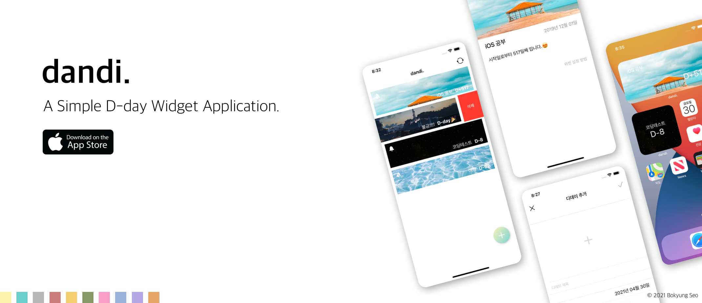
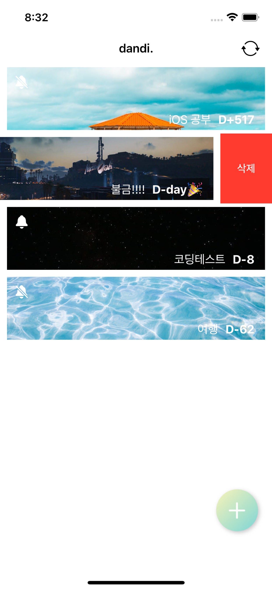
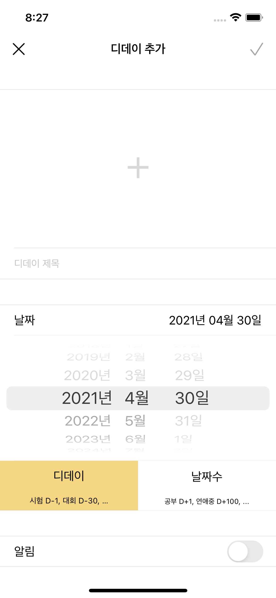
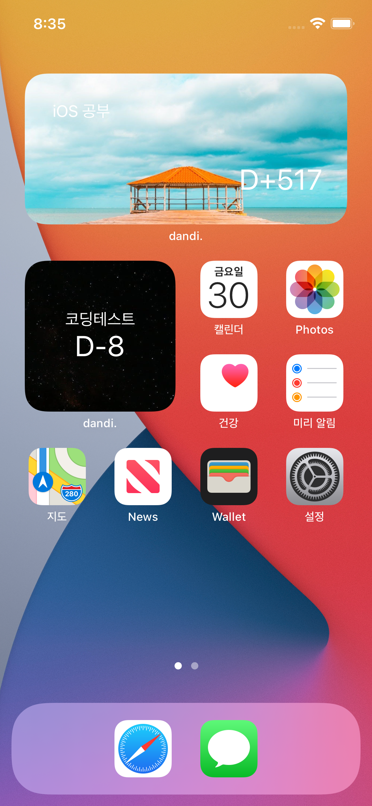

# Dandi.

        

 

단디(dandi) 챙겨! 사용하기 쉬운 디데이 위젯 어플 'dandi.'입니다😊 
메인 이미지를 클릭하여 앱스토어 다운로드 페이지로 이동하실 수 있습니다.🥳
 
 

## 주요 기능

	
	
	
	

 
 

- 일정 등록, 수정, 삭제 : 디데이 정보를 등록하고, 수정하고, 삭제할 수 있습니다.
- 일정 푸시 알림
- 위젯 지원

 
 

## 지원

- dandi.(단디) 앱은 iOS 14 이후부터 지원됩니다.
- help: maybutter756@gmail.com

 
 
